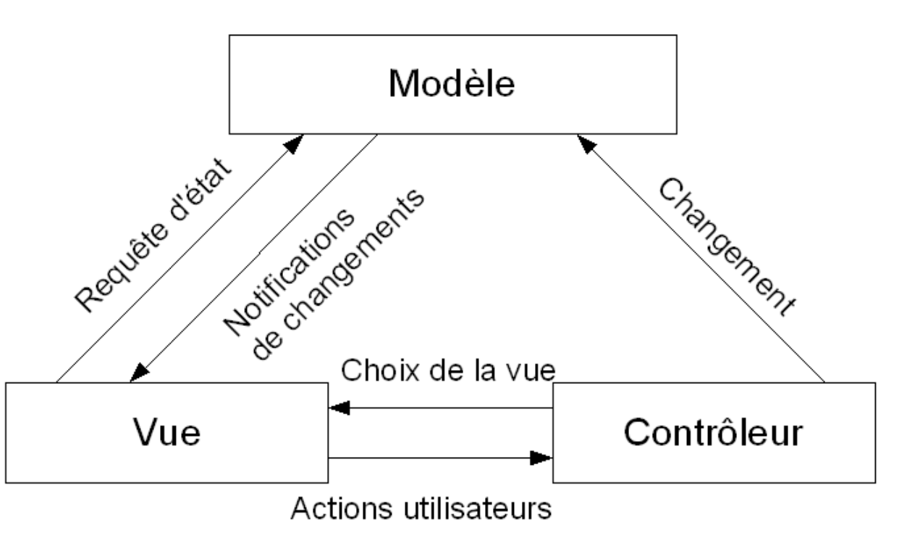
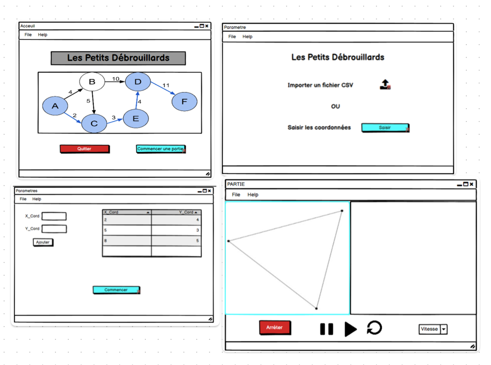
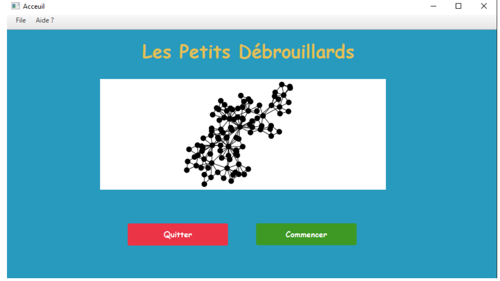
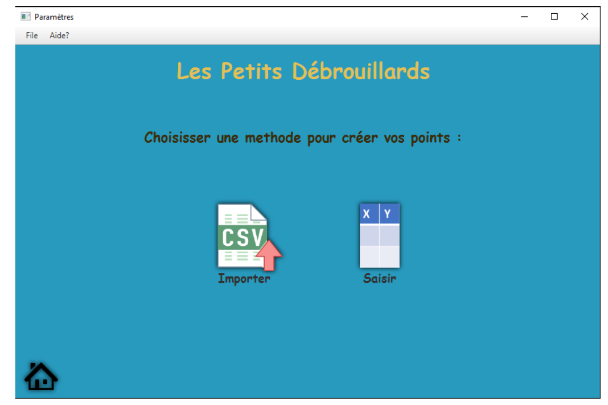
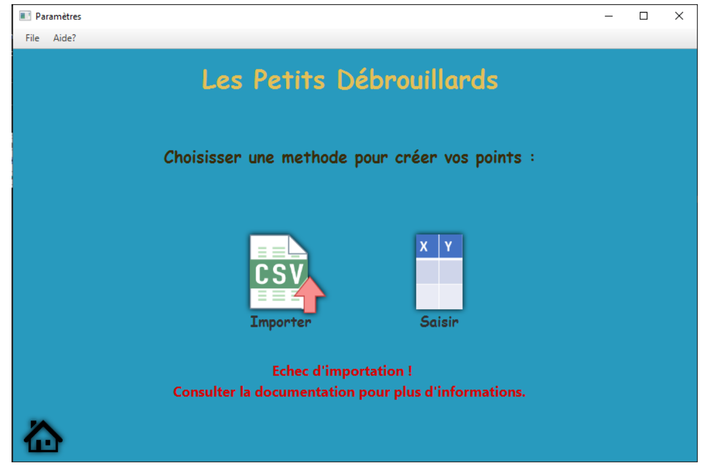
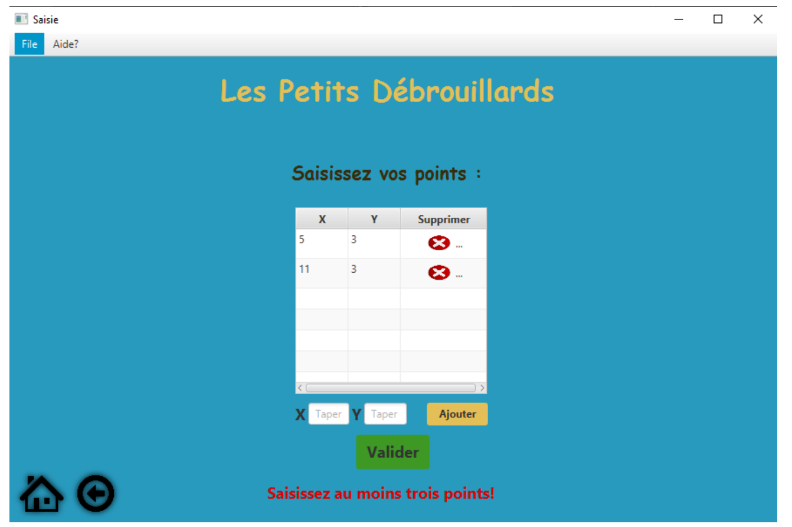
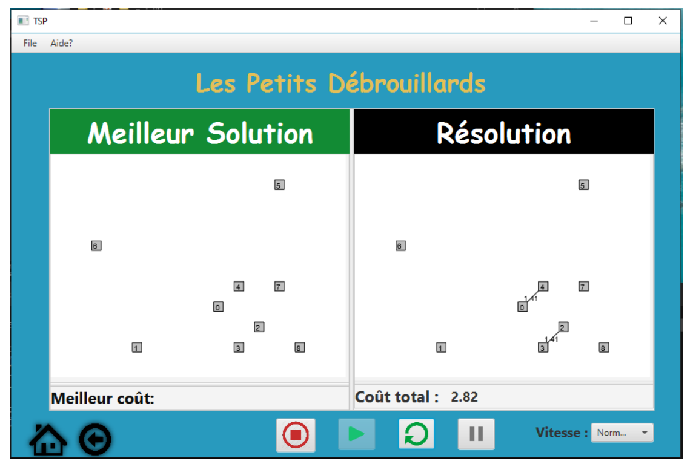
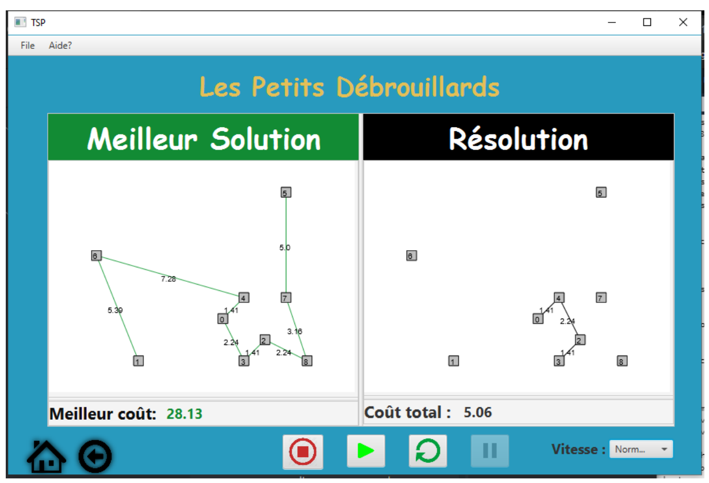

# TSP Visualization App

## Introduction
The TSP Visualization App is a JavaFX desktop application designed to help children understand the Traveling Salesman Problem (TSP) through interactive visualization. This app developpement is  dedicated to science education for young audiences.

### TSP (Traveling Salesman Problem)
The Traveling Salesman Problem is a classic optimization problem where the goal is to find the shortest path that visits a set of given points.

## Objectives
The main objectives of this project are:

- Create an easy-to-use interface suitable for children.
- Develop a functional prototype to demonstrate the TSP algorithm using a provided .jar file.

### MVC Architecture
The project follows the Model-View-Controller (MVC) architectural pattern:

- **Model**: Provides the necessary functionality for the graphical interface and represents the .jar file.
- **View**: Consists of FXML files that organize and structure the interface components.
- **Controller**: Manages view changes and user interactions, with multiple Java classes handling communication between the view and the model.

## Mockup
Before implementation, a mockup was created to visualize the different interfaces required for effective problem representation. Here is the mockup:

### Interface Overview

- **Home Interface**: A simple interface with an image and buttons to start a game or exit.
- **Parameter Interface**: Allows users to choose between importing a CSV file or manually entering points (cities).
- **Enter Points Interface**: After choosing to enter coordinates manually, users can input various points and store them in a table before starting the game.
- **CSV File Load Interface**: Allows users to load a chosen CSV file and proceed to the game interface.
- **Game Interface**: Divided into two panels: one for algorithm progress visualization and the other for displaying the best solution (shortest path). It includes buttons for play, pause, restart, stop, and a combo-box for changing the animation speed.

## Development Environment
The project was developed using the following tools:

- IDE: Netbeans (version 8.2)
- Framework: JavaFX
- Graph Library: Graph Stream (JavaFX 2.0)

## User Interfaces

### Home Interface
- A welcoming interface with dynamic visuals and buttons for starting the game or quitting.

### Parameter Interface
- Allows users to choose between two modes:
  - Importing a CSV file: Takes users to the game interface after selecting a CSV file that adheres to specific standards.
  - Manual input: Allows users to enter points, showing error messages for incorrect input.

### Enter Points Interface
- Users can input city coordinates, add them to a table, and validate their selections for starting the game. Proper error handling is provided.

### Game Interface
- Shows point representations, algorithm progress, and the best solution (shortest path). Includes buttons for play, pause, restart, stop, and a combo-box for changing animation speed.

## Running the Application
To run the TSP Visualization App, follow these steps:

1. Ensure you have JavaFX installed. You can refer to the [official JavaFX documentation](https://openjfx.io/openjfx-docs/install-javafx) for installation instructions.

2. Navigate to the "dist" folder that contains the .jar file.

3. Execute the following command:
   
`java --module-path PATH-TO-FX --add-modules javafx.controls,javafx.fxml -jar TP2-Prototypage.jar`

Replace `PATH-TO-FX` with the path to your JavaFX SDK.

## License
This project is licensed under the [MIT License](LICENSE).

Feel free to contribute or report issues if you find any!

